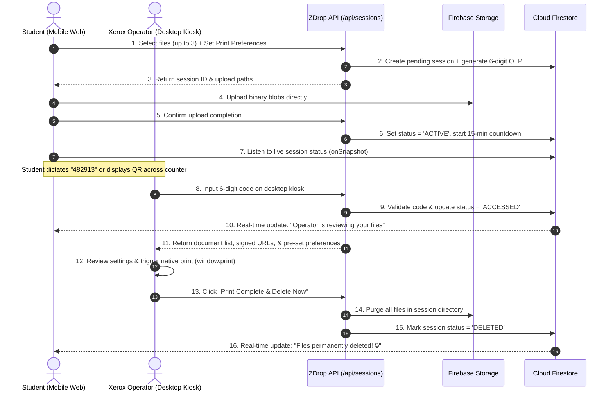

# ZDrop - Application Flow & User Journeys

> **Document Version:** 1.0.0  
> **Target Actors:** Student / Customer (Mobile Web POV) & Xerox Operator (Desktop Kiosk POV)  

---

## 1. End-to-End Sequence Diagram

---

## 2. Customer / Student POV Flow (Mobile Web)

### Step 1: Frictionless Landing & Drop Zone
- **Screen:** `zdrop.app` (Mobile Viewport)
- **Action:** Student visits site on smartphone browser (Safari/Chrome). No account creation, no password, no phone number required.
- **UI Elements:**
  - High-trust banner: "Drop it. Print it. Done."
  - Dropzone card with upload icon: "Tap to select document (PDF, DOCX, JPG, PNG)".
  - File picker triggers device storage.
- **Validation:** Enforces maximum 3 files, 25MB individual file limit.
- **Card State:** Uploaded files appear as pill chips with file size, detected page count, and removal button (`✕`).

### Step 2: Print Preferences Configuration
- Immediately below the dropzone, an intuitive preferences card expands:
  - **Copies Stepper:** `[-] 1 [+]` (with intuitive tap increment).
  - **Color Mode Segment:** `[Black & White]` (active) / `[Color]`.
  - **Sides Segment:** `[Double-Sided (Duplex)]` (active) / `[Single-Sided]`.
  - **Page Selection:** Radio choice: `(•) All Pages` or `( ) Custom Range: [ e.g. 1-12 ]`.
  - **Optional Note:** Input for quick requests: *"Staple corner"*.

### Step 3: Code Generation & Ephemeral Session Creation
- Student taps primary button: **`Generate Access Code`**.
- File binaries stream directly to Firebase Cloud Storage via secure signed pathways.
- System registers Firestore document and generates a unique 6-digit OTP (e.g., `4 8 2 9 1 3`).

### Step 4: Live Access & Real-Time Privacy Tracker
- The screen transitions smoothly to the **Access Code Display**:
  - Huge, high-contrast monospace code: `4 8 2 9 1 3` with one-tap copy button.
  - Dynamic QR Code containing deep-link `https://zdrop.app/kiosk?code=482913` for instant counter scanning.
  - **Live Countdown Timer:** `Expires in 14:48` with a pulsing live green heartbeat dot.
  - **Real-Time Step Indicator**:
    - `[✓] Uploaded` (Done)
    - `[•] Waiting for Operator...` (Pulsing blue)
    - `[ ] Printed & Destroyed` (Pending)
  - Emergency Action: **`Revoke Session & Delete Files Now`** (Red outline button, allowing student to cancel anytime).

### Step 5: Destruction Confirmation
- The moment the operator completes printing, the Firestore listener detects `status: 'DELETED'`.
- The screen displays a celebratory privacy confirmation:
  - *"Done! Your documents were printed and have been permanently purged from ZDrop storage."*
  - Shows anonymous receipt: *"Session duration: 1m 42s · 0 bytes retained."*
  - Clean "Done / Print Another Document" CTA.

---

## 3. Xerox / Print Shop Operator POV Flow (Desktop Kiosk)

### Step 1: Kiosk Station Mode
- **Screen:** `zdrop.app/kiosk` (or `zdrop.app/operator`)
- Designed specifically for shopkeepers running on Windows desktop PCs, chrome kiosks, or touch terminals.
- **UI Elements:**
  - High-visibility header: "ZDrop Kiosk - Fast & Private Document Queue".
  - Large centered OTP input with 6 auto-advancing boxes (`[ ][ ][ ] - [ ][ ][ ]`).
  - Physical keyboard number pad focus active by default (operator doesn't even need a mouse).
  - Web camera QR scan shortcut button for kiosks equipped with webcams.

### Step 2: Code Lookup & Pre-Flight Inspection
- Operator types `482913` or scans QR.
- Within <500ms, the screen transitions to the **Job Inspection Console**:
  - **Summary Banner:**
    - Document Name: `assignment_final.pdf` (12 pages, 2.4 MB)
    - **Copies:** `2 Sets`
    - **Color:** `Black & White`
    - **Sides:** `Double-Sided`
    - **Pages:** `All Pages (1-12)`
  - Embedded PDF preview frame (rendered securely via browser PDF engine).

### Step 3: Print Dispatch
- Operator reviews the pre-filled preferences.
- Operator clicks high-contrast button: **`Print Document (Ctrl+P)`**.
- Native browser print dialog launches automatically with target printer pre-selected.

### Step 4: Instant Destruction & Queue Reset
- Once the printer spools the pages, operator clicks: **`Mark Printed & Purge Files`** (keyboard shortcut `Enter` or `Esc`).
- The backend immediately deletes the files from Cloud Storage and updates Firestore.
- Operator screen shows a brief toast: *"Job completed. Storage cleared."* and immediately resets the 6-digit input box for the next student in line.

---

## 5. Exception Handling & Edge Cases

| Scenario | System Response | Recovery Action |
| :--- | :--- | :--- |
| **Expired Code (Student arrives after 15 mins)** | Backend returns `410 Gone`. Operator sees "This code has expired and files were auto-purged." | Student mobile shows "Session Expired due to 15-minute privacy limit". Student re-uploads in 2 taps. |
| **Paper Jam / Printer Failure** | Operator needs to reprint before files are deleted. | Operator does *not* click "Mark Printed" until physical sheets exit the tray. Files remain accessible until the 15-minute TTL expires. |
| **Accidental Student Revocation** | Student accidentally hits "Revoke". | Confirmation modal: *"Are you sure? All files will be deleted immediately."* |
| **Student Network Disconnect** | Mobile loses connection after uploading. | The 6-digit code remains active on the server; the student can still verbally dictate the code displayed on their screen. |
